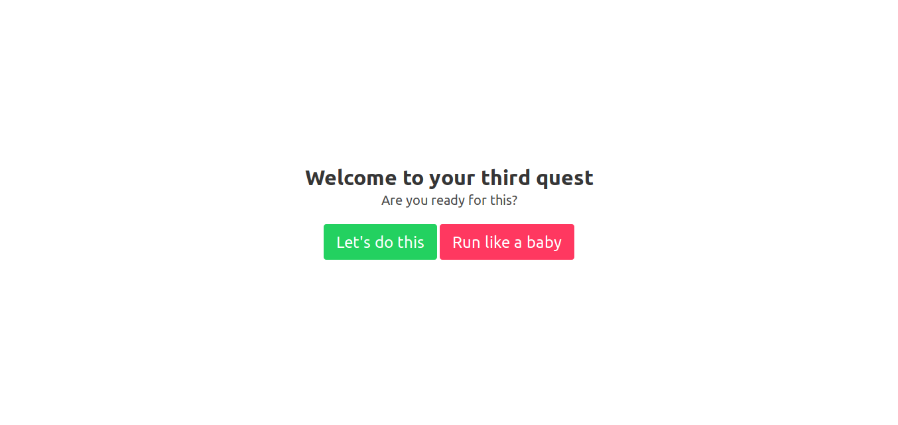
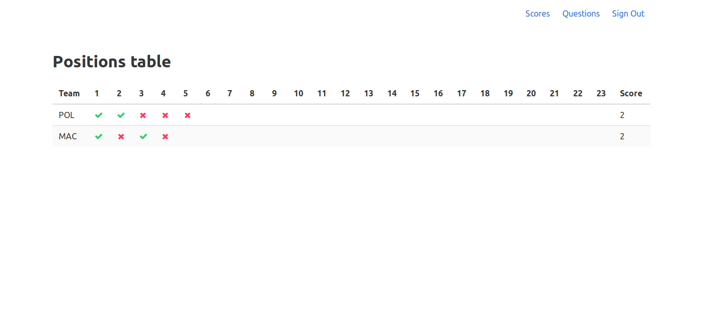
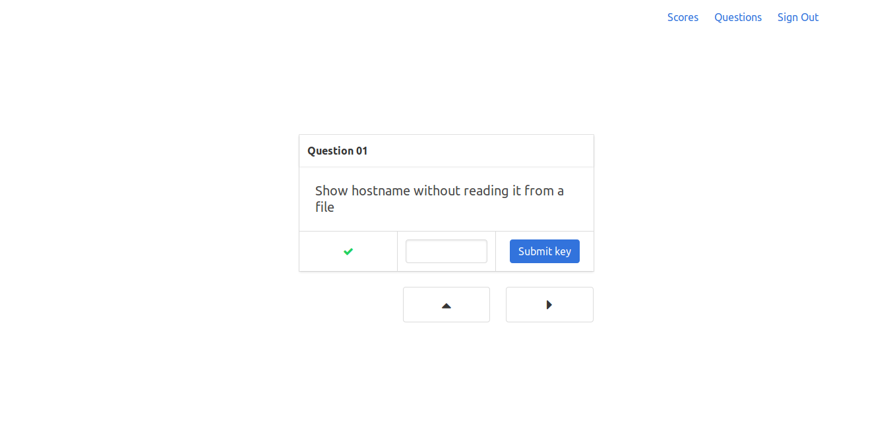
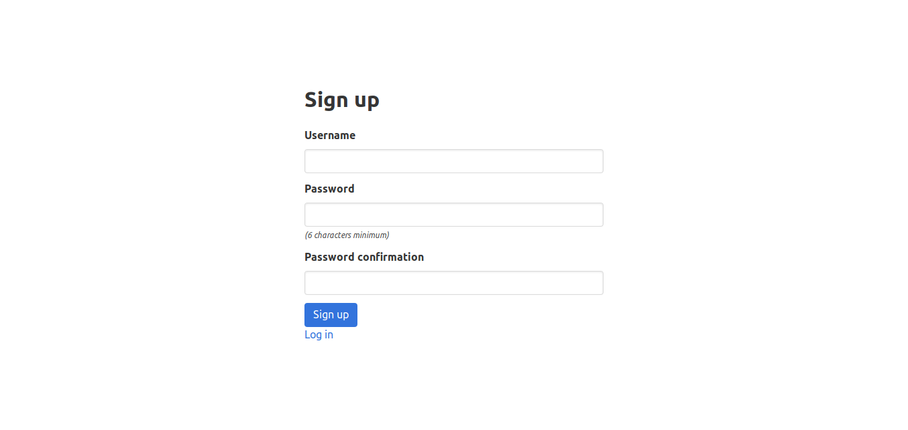
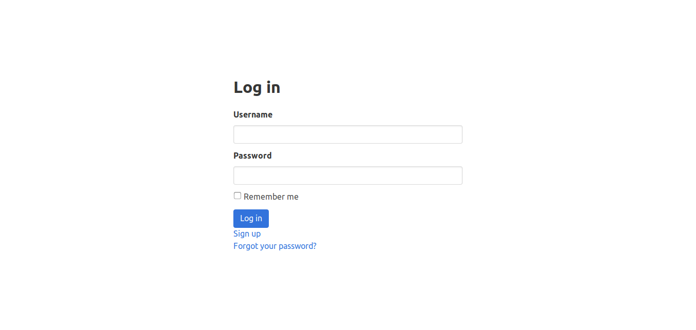
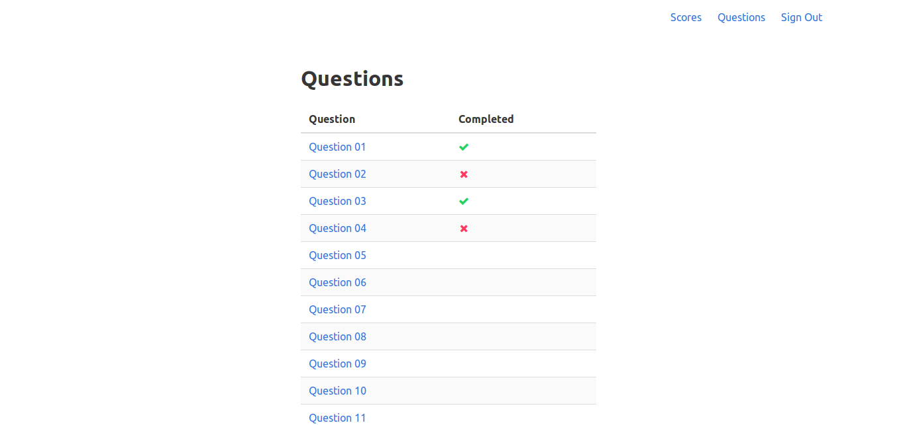

# qu3st server

This server is one of the three parts that compose the system used as MAC's
third test for potential new members. It has questions that should be answered
by the participants.

## A bit of background first

MAC, Mantenimiento de Aulas Computarizadas, (Maintenance of Computarized
Classrooms) is a student group of the Simón Bolívar University, in Caracas,
Venezuela. It's a group of students with passion and interest for System
Administration of UNIX-like systems.

Every year, the members of MAC run a group of four assignments during a regular
period (3 months) as process of admission of new members. Through these
assignment or tests, potential new members (often called pre-newbies) study,
learn and practice their skills in the world of system administration and
UNIX-like systems, learn to work in team while the members analyze their
performace: how they behave in a team, how do they balance their regular classes
with the extra content they receive during the admission, etc.

The third assigment in the process of admission is a practical one: it's a RPG
adventure game where prenewbies are guided by a helper (a script) on a tty,
while they try to solve questions in another tty, and then submit their answers
to the `qu3st-server` through a GUI.

Although the _theme_ of the adventure varies from year to year (it usually is
about classic games like Mario, The Legend of Zelda, Pokémon, or newer things
like Mr. Robot), the structure remains basically the same:

they have to answer ~20 questions or find ~20 keys before they can "fight"
against the final boss (a seemingly unkillable process).

### Why?

Of course, every participant or team must beat the "game" on their own computer,
but, how do we keep track of which team is taking the lead, or which team has
the most amount of correct answers?

That is the reason I made this project.

I made `qu3st-server` with one thought in mind: to make it as generic as
possible, so future generations can use it as a base for their own version of
the third test. That's why the frontend of the project is so unopinionated: it
should be easy to modify.

On the backend, I tried to keep it simple and configurable:
- Database schemas are solid and simple, composed of three basic object with
	well stablished relations: Teams, Answers, and Questions.
- The questions asked (and their respective answers) are located in
	**db/seeds.rb**, so they can be changed with ease, and updated with the
	command: `$ rails db:seed`

Other than that, I wanted to practice my Ruby on Rails skills.

## Prerequisites

This project depends on:
- Ruby, any version from ~2.5 _should_ work, but it's tested using Ruby 2.6.3.
- Sqlite3 for the database on the dev env.
- PostgreSQL for the database on the prod env.

## Installing

Clone the repository, and install the necessary gems:
```sh
git clone <git-repo-url>
cd qu3st-server
bundle install
```

### Deployment

I'm not sure how to deploy this project. TODO.

## Pictures
Cover | Positions Table | Individual Question
----- | --------------- | -------------------
 |  | 

Sign Up | Log In | List of Questions
------- | ------ | -----------------
 |  | 

## Running the tests

The few tests that this project has can be run with the following command (from
the project directory):
```sh
rspec
```
Or if you want to run certain tests:
```sh
rspec spec/models/answer_spec.rb
```

## Contributing

There are a few things I'd like to add to this project:
- A better test suite using RSpec.
- A timer that starts when the first question is answered, and stops when one
	team answers correctly all the questions.
- The necessary changes for a live example on Heroku.
- Generate a JSON response so the server can be used exclusively through it's
	API (in a CLI program, for example).
- Instructions of how to deploy.

If you feel like working on this, or you are a member of MAC who has read this
far, please feel free to hit me up if you're interested in anything related to
this project (or MAC).

In other words, contributions are welcome!

## Authors

* **Iván González Polanco** - *Initial work*

## License

This project is licensed under the GNU General Public License - see the
[LICENSE.md](LICENSE.md) file for details.

## Acknowledgments

* **EAS** - *Source of all existence*
* **José Pascarella (anaco-senpai, JP)** - *Previous version of the server
	(built with Django)*
* **Amín Arria (Amín Asgdfria, AA)** - *Talked to us about Ruby on Rails*
* JK, AM, SV, JT, MF, JO, MD, RB, and D10$.
